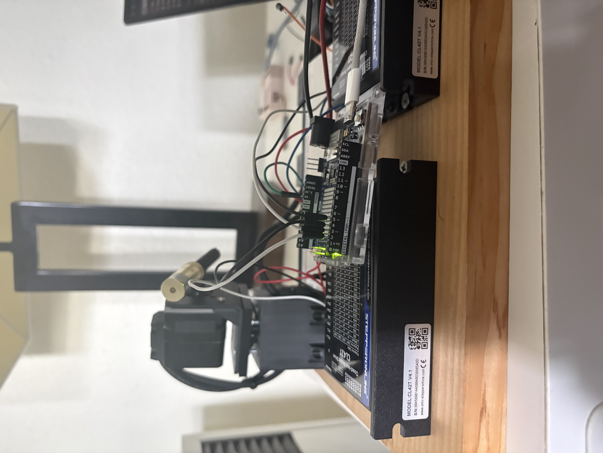
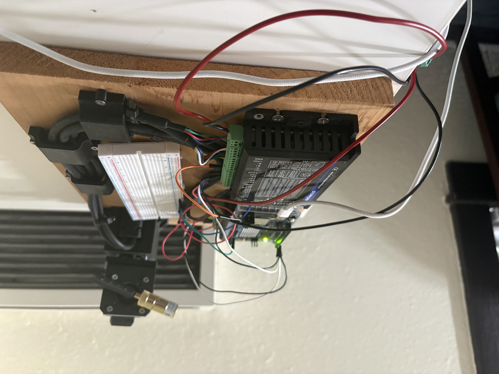

# Star Finder

A motorized alt-azimuth mount that points a laser at a star or planet. You enter your
latitude and longitude and pick a target; the software works out where it is in the sky
right now and drives two stepper motors to aim the laser at it.


## Hardware

- 2 × NEMA 17 closed-loop steppers — one azimuth, one altitude
- 2 × STEPPERONLINE CL42T drivers, 3200 pulses/rev, direct drive
- Arduino Uno R4 WiFi
- Laser module on the tilt axis
- Custom top bracket and NEMA 17 bracket/spacer, designed in Fusion and 3D printed

Wiring: azimuth STEP → D2, DIR → D4. Altitude STEP → D3, DIR → D5. CL42T `PUL+` and
`DIR+` tie to +5 V.

## Layout

```
Firmware/     Arduino firmware
Software/     Python control software
STL/          Mount part drawings
Prototype/    Build photos
```

## Running it

Install the AccelStepper library (Arduino IDE → Tools → Manage Libraries), flash
`Firmware/arduino_side.cpp`, then:

```
pip install skyfield pyserial pynput
python Software/starmain.py
```

It asks for the serial port on startup — `COM4` or similar on Windows. The link runs at
115200 baud.

## Commands

The Python side talks to the Arduino over serial:

| Command | Effect |
|---|---|
| `GOTO:AZ=123.40,ALT=45.00` | Slew to an absolute position |
| `NUDGE:AZ+` / `AZ-` / `ALT+` / `ALT-` | Move 0.5° on one axis |
| `ZERO` | Make the current pose the new (0,0) |
| `HOME` | Return to (0,0) |
| `POS?` | Report position |

## How it points

Skyfield gives the target's altitude and azimuth for your location, `solve_angles`
converts that to motor coordinates, and the Arduino runs both motors there.

The base can only turn 180° before the cables tangle, so to reach the other half of the
sky it turns to the opposite azimuth and the tilt axis swings past vertical, pointing
the laser backward over the top.

For accuracy, the mount is homed to true north and then aligned on two known objects,
which corrects any offset in the pointing.

## Build photos





## Status

Working prototype. The calibration routine still conflicts with the flip and needs a
rewrite, and the physical build could use tidier wiring.
